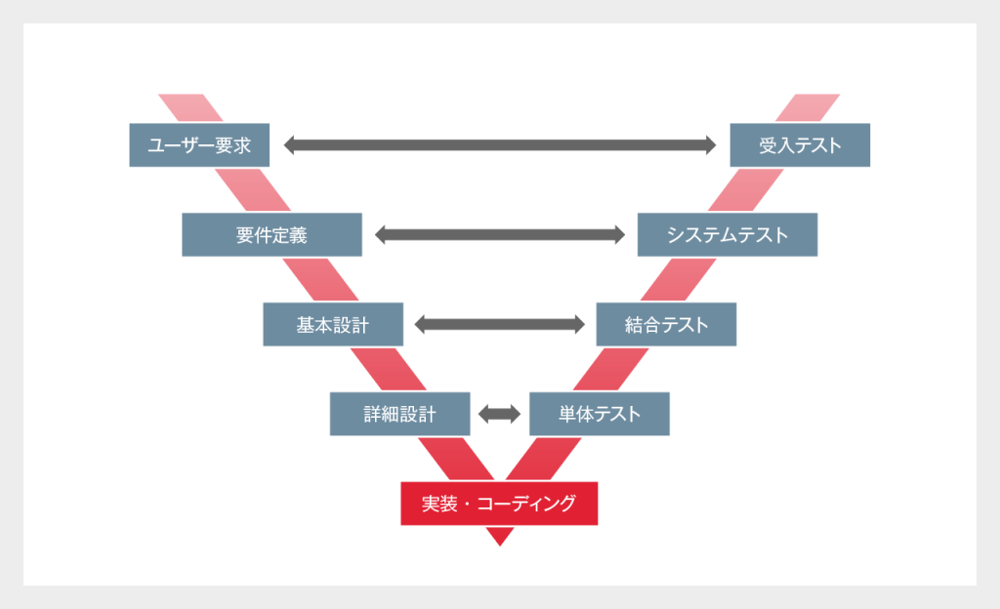

###
+ V字モデル / ウォーターフォール
  + 要求分析 → 要件定義 → 基本設計 → 詳細設計 → コーディング → コードレビュー → 単体テスト → 結合テスト → システムテスト → 受け入れテスト
  + 

### 1 システム開発地図
+ 概念クラス図 → 業務フロー → ユースケース → （状态图）*n → （时序图） → クラス図

### 2 責任分界
+ 発注者 業務分析,システム要件定義,ユースケースモデル
+ 準委任 システム要件定義,方式設計
+ 請負 概要設計(基本設計)

### 3 SysML vs UML
  + 要求図,アクティビティ図,内部ブロック図
  + 为什么做 → 有什么 → 怎么流 → 怎么连接 → 怎么变化 → 怎么通信 → 怎么实现

### 5 建模的学习方法
+ 言葉を大切に
+ 目的を忘れない